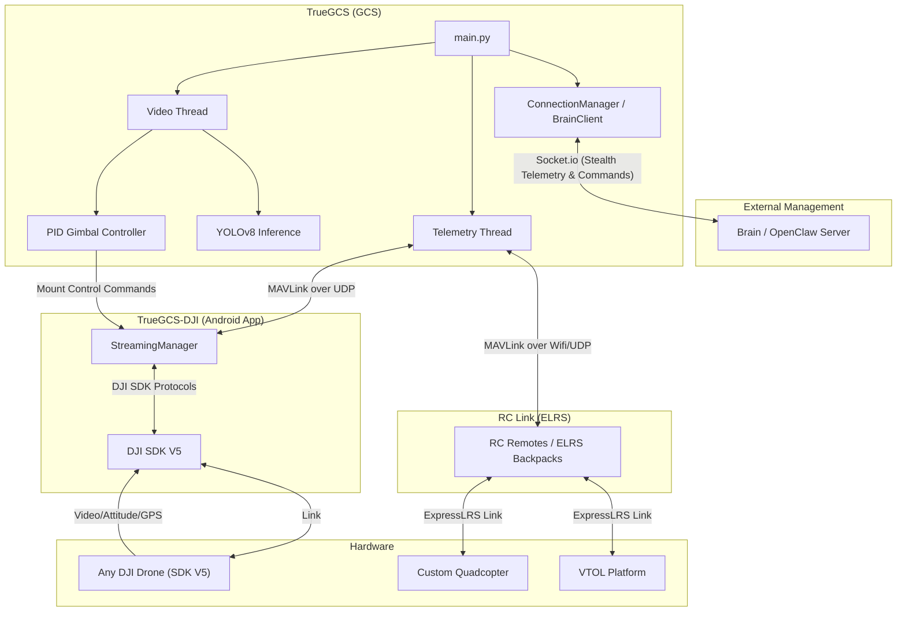

# TrueGCS — Hardened ISR Ground Control Station


> A professional-grade, high-security multi-drone Ground Control Station.  
> Built on MAVLink, PySide6, and the **Cython-Hardened** TrueGCS Core.

---

## 🛡️ High-Security Architecture

TrueGCS is designed for sensitive ISR operations where code integrity and model protection are paramount.

- **Cython Shield**: Core logic (`core/`, `telemetry/`, `video/`) is compiled into machine-code binaries (`.so`/`.pyd`) during build. This prevents reverse engineering and ensures near-native execution performance.
- **TrueShield™ Model Protection**: AI weights are protected with AES-256 encryption. Models are only decrypted in volatile memory or hidden temporary structures, never stored as plain `.pt` files in production builds.
- **Bundle-Aware Security**: Fully compatible with macOS `.app` and Windows `.exe` distributions. Uses a secure path-resolution system (`sys._MEIPASS`) for internal resource integrity.

---

## 🚁 DJI Native Support (New)

TrueGCS now supports **SDK V5 compatible DJI drones** via the **TrueGCS-DJI (Android App)**. This allows tactical ISR features (AI tracking, hardened telemetry) to be used with standard DJI hardware.

- **Bidirectional MAVLink Translation**: Translates GCS Mount Control commands to DJI SDK speed/angle rotations.
- **High-Frequency Feedback**: 10Hz attitude and GPS telemetry streaming from the drone to the GCS.
- **Rate-Based Gimbal Tracking**: Utilizes a precision P-controller to eliminate mechanical overshoot during AI target acquisition.

---

## ## Screenshots

| Swarm Simulation | Simulation Controller |
|:-:|:-:|
|  |  |

| AI Tracking Config | Configuration Tab |
|:-:|:-:|
|  |  |

---

## ✨ Features

### 📡 Tactical Operations
- **Low-Latency Video Engine**: Optimized DJI RTMP-to-UDP relay with `threads=1` single-threaded decoding to eliminate frame-reordering lag.
- **High-Res Map Engine**: Leaflet-based map utilizing **Esri World Imagery** with native zoom support up to level 19 for pin-sharp reconnaissance.
- **Multi-Drone Command**: Unlimited concurrent MAVLink links with auto-discovery and color-coded telemetry streams.
- **Mission Planner**: Tactical waypoint placement with per-point altitude and speed control.
- **HUD Overlay**: Speed, Altitude, Battery, Mode, EKF status, Lidar range, and high-frequency sensor diagnostics.

### 🎥 AI Reconnaissance
- **YOLO26 ISR Models**: Custom-trained weights optimized for aerial vehicle and person detection (VisDrone-v2).
- **Monotonic Sync**: Advanced frame-matching logic that synchronizes AI detection overlays with live video feeds at a tactical 50ms offset.
- **Gimbal Tracking**: PID-based target locking with support for `DO_MOUNT_CONTROL` MAVLink commands.
- **Click-to-track**: Nearest detection, pixel seed, or centre slew modes for rapid target acquisition.

### 🛩️ Simulation
- Built-in **VTOL SITL simulator** with multi-instance support.
- Launch multiple drones concurrently from the UI for swarm training.
- Simulates: GPS denial, VTOL transitions, and complex mission fail-safes.

---

## 🏗️ Architecture



```text
TrueGCS/
├── main.py                  # Secure entry point (Bundle-Aware)
├── core/
│   ├── shield.py            # TrueShield™ Encryption/Decryption Layer
│   ├── brain_client.py      # Secure Socket.io Link to OpenClaw Brain
│   ├── connection_manager.py # Automated Command/Telemetry Routing
│   ├── utils.py             # Robust Binary Locator (FFmpeg/GStreamer)
│   └── tile_cache.py        # Offline Tile Server & CDN Fallback
├── telemetry/               # [Cython Compiled] MAVLink Node Logic
├── video/                   # [Cython Compiled] AI Inference & GStreamer Pipeline
├── gimbal/                  # PID-based Mount Tracking
├── ui/                      # Professional PySide6 Dark-Mode Interface
└── models/                  # Shielded AI Weights (.tsm format)
```

---

## 🚀 Performance Tuning

TrueGCS is pre-tuned for zero-lag performance:
- **Relay**: `-probesize 32 -analyzeduration 0` for instant stream start.
- **Decoder**: `-fflags nobuffer -flags low_delay` for real-time situational awareness.
- **Map**: Local Tile Server fallback for offline "Grid-Down" operations.

---

## ⚙️ Requirements

| Dependency | Version |
|---|---|
| Python | ≥ 3.10 |
| PySide6 | ≥ 6.5.0 |
| pymavlink | ≥ 2.4.40 |
| opencv-python | ≥ 4.8.0 |
| ultralytics | ≥ 8.0.0 |
| Cython | ≥ 3.0.0 |
| cryptography | ≥ 41.0.0 |

---

## ⚖️ License

Copyright (c) 2025 True2456. All rights reserved.

This software is provided for personal, non-commercial, and evaluation use only.  
**High-Security Release**: Commercial use, redistribution, or decompilation is strictly prohibited without prior written permission from the copyright holder.

See [LICENSE](LICENSE) for full terms.
