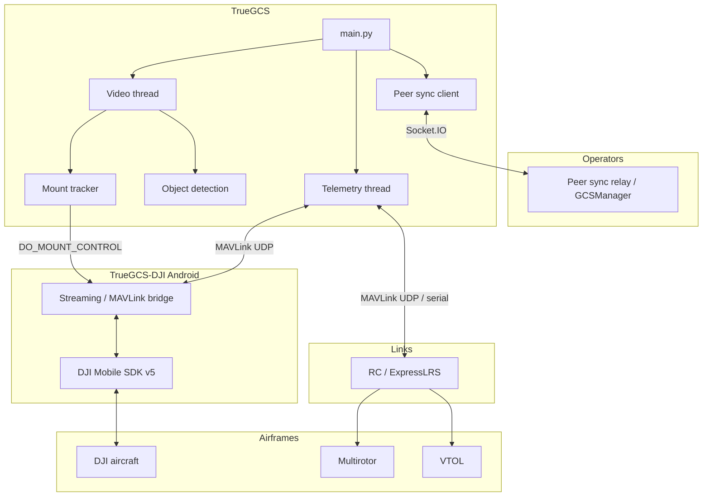

# TrueGCS

Ground control station for MAVLink aircraft and DJI airframes (Mobile SDK v5 via companion Android bridge). Desktop client is Python / PySide6.

Supports multi-vehicle control over concurrent MAVLink links, live video with optional onboard object detection, gimbal slew from track error, map and 3D (Cesium) views, waypoint missions, and optional station-to-station telemetry sync.

---

## Screenshots

| Multi-vehicle simulation | Simulation controls |
|:-:|:-:|
|  |  |

| Detection / tracking settings | Vehicle parameters |
|:-:|:-:|
|  |  |

---

## Capabilities

### Flight and telemetry
- Concurrent MAVLink connections (UDP / serial) with per-system-id discovery
- Mode, arm state, attitude, position, battery, and HUD overlays
- Waypoint upload and mission start; per-waypoint altitude and speed
- Camera ground footprint projection on the map and Cesium globe
- Offline map tiles (Esri World Imagery; optional regional pre-download)

### Video and payload
- UDP / USB capture via GStreamer; RTMP-to-UDP path for DJI downlinks
- YOLO-based detection overlays with configurable confidence and class filters
- Track modes (nearest detection, pixel seed, center slew) driving `MAV_CMD_DO_MOUNT_CONTROL`
- Detection-to-display timing offset (~50 ms) to reduce overlay lag

### DJI (SDK v5)
Requires the TrueGCS-DJI Android companion app:
- Bridges DJI telemetry into MAVLink for the desktop GCS
- Maps mount-control commands to DJI gimbal rate / angle APIs
- Attitude and GNSS reported at up to 10 Hz over the bridge

### Simulation
- Built-in VTOL and multirotor SITL-style sims for bench testing
- Multi-instance launch from the UI
- GPS denial and VTOL transition scenarios for failsafe / mode checks

### Multi-operator sync (optional)
Under **Config → Peer GCS Sync** (off by default):
- Two (or more) TrueGCS instances share a Socket.IO relay (`GCSManager`)
- Independent transmit / receive of telemetry; optional video share
- Remote command / mission ingest disabled unless explicitly enabled
- Optional shared secret; relay defaults to `127.0.0.1:3001`

---

## Architecture


```mermaid
graph TD
    subgraph Operators
        PeerRelay["Peer sync relay / GCSManager"]
    end

    subgraph TrueGCS
        Main[main.py]
        Tel[Telemetry thread]
        Vid[Video thread]
        Peer[Peer sync client]
        Main --> Tel
        Main --> Vid
        Main --> Peer
        Vid --> Det[Object detection]
        Vid --> Gimbal[Mount tracker]
    end

    subgraph Links
        ELRS["RC / ExpressLRS"]
    end

    subgraph TrueGCS_DJI["TrueGCS-DJI Android"]
        Bridge[Streaming / MAVLink bridge]
        SDK[DJI Mobile SDK v5]
    end

    subgraph Airframes
        DJI[DJI aircraft]
        Quad[Multirotor]
        VTOL[VTOL]
    end

    Peer <-->|Socket.IO| PeerRelay
    Tel <-->|MAVLink UDP| Bridge
    Tel <-->|MAVLink UDP / serial| ELRS
    ELRS --> Quad
    ELRS --> VTOL
    Gimbal -->|DO_MOUNT_CONTROL| Bridge
    Bridge <--> SDK
    SDK <--> DJI
```

```text
TrueGCS/
├── main.py              # Application entry and signal routing
├── core/                # Config, peer sync, geolocation, model crypto helpers
├── telemetry/           # MAVLink I/O thread
├── video/               # Capture and inference pipeline
├── gimbal/              # Mount track controller
├── GCSManager/          # Optional peer-sync relay (Node.js)
├── ui/                  # PySide6 UI
├── simulation/          # VTOL / multirotor sims
└── models/              # Detector weights (.tsm / .tflite)
```

Release builds may Cython-compile selected `core/` and `telemetry/` modules. Detector weights can be stored encrypted (`.tsm`); set `TRUEGCS_SHIELD_PASSPHRASE` when using shielded models. Cesium Ion token: UI dialog or `CESIUM_ION_TOKEN`.

---

## Video pipeline notes

Typical low-latency flags used on the relay / demux path:
- Probe / analyze: `-probesize 32 -analyzeduration 0`
- Demux / decode: `-fflags nobuffer -flags low_delay`

Map view falls back to a local tile cache when the network is unavailable.

---

## Requirements

| Dependency     | Version   |
|----------------|-----------|
| Python         | ≥ 3.10    |
| PySide6        | ≥ 6.5.0   |
| pymavlink      | ≥ 2.4.40  |
| opencv-python  | ≥ 4.8.0   |
| ultralytics    | ≥ 8.0.0   |
| Cython         | ≥ 3.0.0   |
| cryptography   | ≥ 41.0.0  |

See `requirements.txt` for the full list. Peer sync relay needs Node.js (`GCSManager/`).

---

## License

Copyright (c) 2025 True2456. All rights reserved.

Personal, non-commercial, and evaluation use only. Commercial use, redistribution, or reverse engineering without written permission is prohibited.

See [LICENSE](LICENSE) for full terms.
